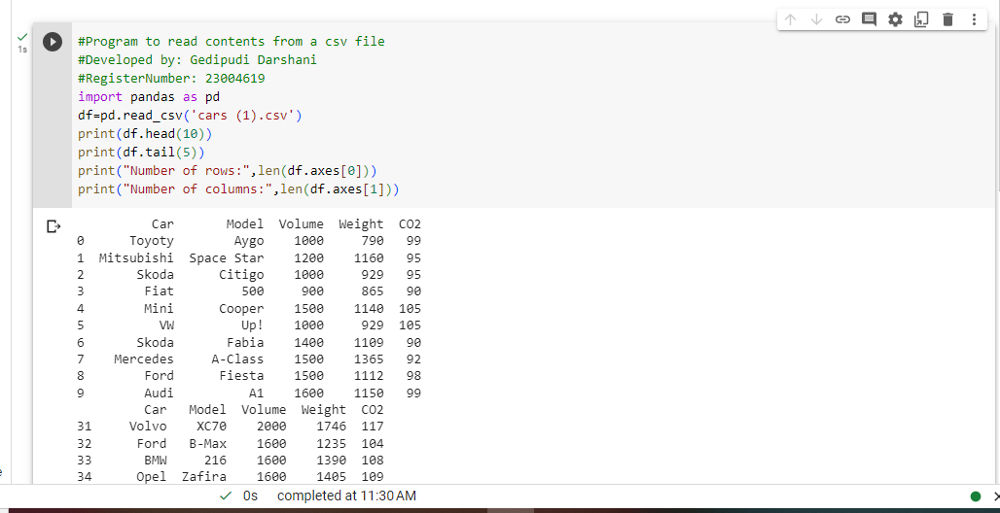
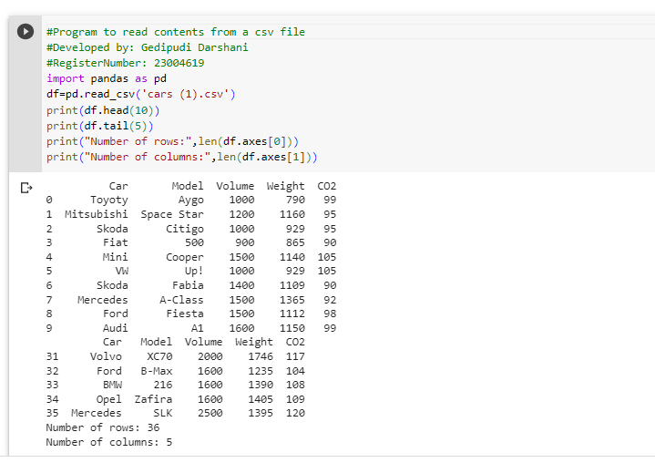

# Read-from-CSV


## AIM:
To write a python program for reading the csv title content.
## ALGORITHM:
### Step 1:
Load the csv into a DataFrame.
### Step 2:
Print the number of contentss to be displayed using df.head().
### Step 3:
The number of rows returned is defined in Pandas option settings.
### Step 4:
Check your system's maximum column with the pd.options,display.max_column statement.
### Step 5:
Increase the maximum number of rows to display the entire DataFrame.
## PROGRAM:
``````
#Program to read contents from a csv file
#Developed by: Gedipudi Darshani
#RegisterNumber: 23004619
import pandas as pd
df=pd.read_csv('cars (1).csv')
print(df.head(10))
print(df.tail(5))
print("Number of rows:",len(df.axes[0]))
print("Number of columns:",len(df.axes[1]))
``````
## OUTPUT:


## RESULT:
Thus a python program is written to read the contents of a CSV file.
